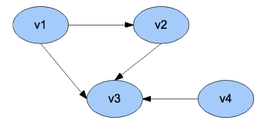
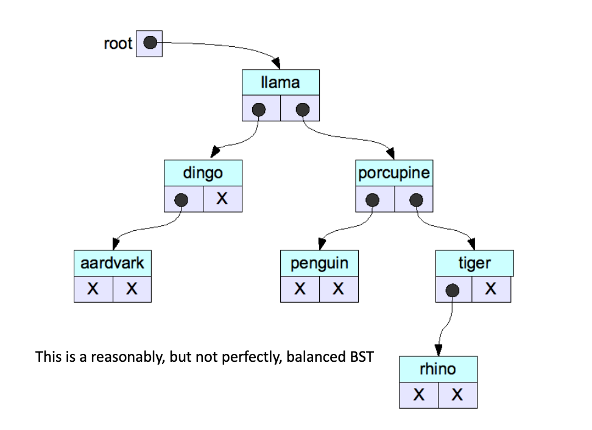

# A LOL Implementation

We can implement the priority queue using a list of lists (LOL). We have PQ nodes, each of which represents a priority, then each node has a `first*` and `last*` pointer to a queue of that priority.

We effectively separate each priority, while maintaining order.

# How is <priority_queue> Implemented?

Although the LOL feels like the natural thing to do, the STL library implements the priority queue using a __heap__. A heap is a type of binary tree. There is a root, and each children may have up to two children.

There will always be a path from one node to another, each node has a single parent, and there are no loops.

## Implementation Using `vector`

Without pointers, we can implement a heap only using vector and indicies.

For a node at index i, the left child is at index 2i+1, right child is at index 2i+2, and the parent is at (i-1)/2. Because of the way heaps are built, there is minimal wasted storage.

## LOL vs. Heap 

| PQ implementation      | PQ_enter | PQ_leave | PQ_first |
|------------------------|----------|----------|----------|
| List-of-lists (LOL)    | O(K)     | O(1)     | O(1)     |
| Heap                   | log<sub>2</sub>(N) | log<sub>2</sub>(N) | O(1)     |

For very small datasets, the LOL implementation is superior, but for large datasets the heap becomes clearly superior.

# Graphs

Let's expand the idea of a tree where cycles can happen and each node can have an arbitrary amount of children. We now have a graph. A graph `G` is a set of verticies and edges.

Each edge is a connection between two nodes.

For example, V = {v1, v2, v3, v4} and E = {(v1, v2), (v1, v3), (v2, v3), (v4, v3)} represents the graph below.



Graph theory is its own discipline, we will not be discussing graphs in great depth.

## The Traveling Salesman Problem (TSP)

Given a list of cities (nodes) and the distances between each pair of cities (weighted edges), what is the shortest possible route that visits each city exactly once and returns to the origin city?

In math, find the minimum length Hamiltonian cycle (each node visited exactly once, but finishing again at the start node).

### Solution?

You can solve the answer in brute force, you can pick a starting city, then a second, a third. The complexity of this approach is horrible, because there is no known feasible polynomial-time solution for large N.

However, there are polynomial-time __heuristics__ that can solve TSP in a percentage of optimality. The TSP is known as a NP-hard problem, meaning it is solvable in principle not in practicality.

Reliable encryption systems depends on the existence of problems such as these, which are hard to crack. However, quantum computing might change how fast exponential time complexity grows.

# Trees

As a linked structure, we typically allocate trees on heap using `new`. The top node is the `root`, a node without children is called a `leaf`, and non-leaf nodes are called child nodes.

A general tree is called a N-ary tree. The height of a tree is the longest path from the root to a leaf. The depth of a node is the length of the root to the node.

## Binary Trees

The left and right nodes have 2 children, we called this a "heap" earlier. Non-binary trees typically use a vector of Nodes to link nodes together. Because we have a fixed number of nodes, the implementation is simple.

```cpp
struct Node {
    string value;
    string otherStuff;
    Node* left;
    Node* right;
};
```

## Binary Search Trees

A special type of ordered binary tree. The binary search tree has nodes with a special key value. The BST property is that every key of the left subtree of a node is smaller than the node's value, every key to the right of a node is larger than the tree's value.

This means, just because a key to the right of a child node is larger than the child node, it is still smaller than the parent node of the child node, if it is to the left. This is the special priority of the BST.



For any given dataset, there is are many types of BSTs.

Am I right to say a sorted linked list is a type of binary search tree? Yes, if each node has exactly one child.

## BST Operations

1. Lookup
2. Insert
3. Print
4. Delete

Recall that the BST property holds at every node in the whole tree. If I pick an arbitrary node, the subtree with that node as root is also a BST! We need to preserve the BST property, and also, we can use recursion.

### Lookup

If we want to search for any element, we can run recursive binary search.

The base case is if we reach a leaf, or if we find the element. Else we re-perform search with halved bounds. Now we know if an element exists; however, it might be much more useful to return the value of the node.

### Insert

The deal is, if we find where the key is supposed to be but we find a nullptr (root empty) then we create the node. We search using the key, just like BST_lookup.

Let's assume that no deletions have occurred yet. Assuming the simple BST_insert algorithm is used (and no deletions
have occurred), any node in the tree is older than both of its children.

The oldest node is the root! Thus, the order of insertion of nodes determines the shape of the BST, in particular how balanced it is.

### Print

Since each subbranch is strictly less or greater, we can print the tree is sorted order in three lines. Print the left (smaller), print the node itself, and print the right (larger). All subinstances are guranteed to be sorted as well.

The print implementation here uses a well-known algorithm for iterating through the nodes of a binary tree called inorder traversal.

While we can trace through the execution carefully using a stack model as , there's a cool trick for tracing inorder tree traversals.
- When encountering a leaf node, print the key value
- The second time encountering an internal node, perform the operation!

[alt text](image1.png)

## Recursive vs. Iterative

For binary search trees, and especially binary search trees, a recursive solution is far more elegant and simple. Sometimes iterative solutions are more efficient, but undeniably recursion is a easy thing to do.