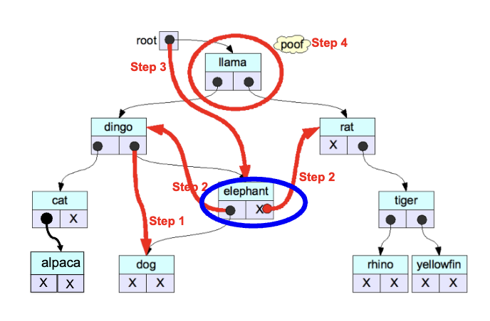

# Deleting from A Binary Search Tree

There are three cases we need to consider, because deletion has no standard procedure. Deletion is not so simple.

1. Target node has no children.
    - Delete the target node, set parent ptr to `nullptr`.
2. Target node has one child.
    - Set target's parent to point to target's (only) child, then delete target node.
3. Target node has two children.
    - Umm...

## Case 3

Let's assume we want minimal disruption on the structure of the tree. We need to find a replacement for the tree. We have two possible replacement nodes, the largest key in the left subtree, or the smallest key in the right subtree.

If we decide to choose the left subtree, all descendants are less than our target key, and if the largest item has a right child, there is a larger element in the left subtree, which is a contradiction.

We know the replacement node will have zero or one children.

### Variant 1

1. Connect replacement's parent to replacement's child (if it exists) to temporarily disconnect the replacement node from the subtree
2. Then insert the replacement node in place of the target node
3. Set replacement node's left / right ptrs to values of target's left / right ptrs, respectively
4. Set target's parent to point to replacement node
5. Delete target node



### Variant 2

1. Find the replacement node (e.g., max value in left subtree)
2. Copy the data values of the replacement node (but not the ptrs) into the target node. If this is a BIG object, this might be expensive, but we won't worry for now
3. Call BST_delete (target->left, target->key)

Note that target->key is the key of replacement node, not the original target. We are guaranteed that this will hit one of the first two cases and the replacement node will be deleted.

## Complexity of `delete`

With this implementation, you first find the target node, then dive down
one of its subtrees to find the largest (smallest) element in the left (right)
subtree

The deepest you will go, or number of comparisons, is the height of the tree O(h).

__Best Case__
O(h) == O(log<sub>2</sub>N)

__Worst Case__
O(h) == O(N)

## Delete and Balacing

Ignoring unbalanced trees is probably a bad idea.

- Periodically do a mass rebalancing or rebuild
- A bit like Garbage Collection and vector space reallocations, but probably not worth it
- On each insertion, do a little work to make sure that the tree is "reasonably" well balanced (CS240)

## Review of BST

A binary search tree (BST) is a binary tree where the following property
holds ay every node.
- The keys of all nodes in the left subtree (if any) are < my key
- The keys of all nodes in the right subtree (if any) are > my key

A BST is a sorted data container
- BST_print produces (lexicographically) sorted data
- And the other operations traverse the data elements lexicographically

Insertion, lookup, and deletion are all O(h), where h is the tree height
- If the tree is reasonably well balanced, then h ≈ log N
- This is the most efficient ADT for storing sorted data that we have seen so far!
- Our insert/delete operations are correct, but do not try to self-balance
- IRL we use self-balancing BSTs to store sorted collections of data

# ADT vs. Data Structure

An abstract data type (ADT) is essentially a mathematical entity; it should be understandable by looking only at its API (eg. stack, queue, deque, priority queue, sequence, dictionary).

A data structure (DS) is more concrete. It connotes some idea of underlying implementation / physical structure /
strategy that may not be discernable from the API alone. Data structures can be used to implement ADTs, tho DSs may be somewhat abstract themselves (eg. vector, linked lists, various trees, hash table).

We will now take a look at the sequence and dictionary / map ADTs. We will consider implementation strategies such as arrays, vectors, linked lists, and BSTs.

# Sequence ADT

A sequence is a container of elements, indexed by a set of contiguous non-negative integers. It's a vector but with an index. Can you guess the functions?

1. `insert` inserts an element into the sequence at the specified position, moving all following elements "one slot to the right" conceptually, increasing the active size of the container by one.
2. append adds a single element onto the end of the sequence, increasing the size by one (like vector<>::push_back).
3. We may also provide a second definition of append that merges one sequence onto the end of another; this is reasonable if we used a linked list to implement it.
4. `at` returns the element at the specified index.
5. remove removes an element from the sequence at the specified position, moving all following elements "one slot to the left", and decreasing the size by one (but not necessarily the capacity, which isn't a thing for ADTs).

## How to Implement?

Here, we are distinguishing between the mathematical sequence ADT.

Roughly, the C++ vector implements the sequence ADT. 
- The C++ Standard requires that vector be implemented as an array for fast accessing of elements, and allows amortized constant time on append (called push_back) as a reasonably trade-off to achieve this

C++ libraries list and deque also implement the sequence ADT.
- `list` uses a vanilla doubly-linked list.
- `deque` allows add / removes at the front and back of the list.

Also, vector, list, deque use iterators for insert / erase instead of integer indexes. They differ in performance on some operations; pick the one that best suits your needs for your problem.

# Dictionary ADT

A dictionary is a data structure containing ordered pairs of the form (key, value). Sometimes called a map, or associative array. The value can be anything.

- `add(key, value)` inserts a ordered pair to the dictionary. We'll assume that it's an error to add a pair if there is already an element.

- `overwrite(key, value)` takes a key and a value, and overwrites the existing value for key with the new value. We can combine the overwrite with the semantics of add.

- `lookup(key)` takes a key and returns the associated value stored in the dictionary.

- `remove(key)` removes the ordered pair (key, dict[key]) from the dictionary.

Dictionaries may support a print operation. Thus, the dictionary may not be sorted when printed, but all the elements will be printed once.

A dictionary may support an iterator that can be used by a client to walk through all of the elements and perform an operation on each, such as "print the value". In many languages there exists a `map` command.


## Implementing a Dictionary

| Data structure           | Add        | Overwrite | Lookup     | Remove     |
|--------------------------|------------|-----------|------------|------------|
| Sorted vector*           | O(N)       | O(log N)  | O(log N)   | O(N)       |
| Unsorted vector          | O(ACT)     | O(N)      | O(N)       | O(N)       |
| Sorted linked list       | O(N)       | O(N)      | O(N)       | O(N)       |
| Unsorted linked list     | O(1)       | O(N)      | O(N)       | O(N)       |
| Vanilla BST**            | O(log N)   | O(log N)  | O(log N)   | O(log N)   |

1. \* The sorted `vector` supports binary search.
2. \*\* Assuming the BST is balanced.

## The C++ `map`

We can declare a map.

```cpp
map<T1, T2> m;
```

T1 is the `key`. The key must support the less than operator, and has strict weak ordering.

### Strict Weak Ordering
1. __Irreflexivity__
    - For all elements (x), the relation (x < x) is false.

2. __Transitivity__
    - For all elements (a, b, c), if (a < b) and (b < c), then (a < c).

3. __Transitivity of Incomparability__
    - For all elements (a, b, c), if a is incomparable with b and b is incomparable with c, then a is incomparable with c.

T2 is a value field, can be anything.

Let's take a look at an application of the `map` in `wordbag.cc`.

# Implementation of the C++ `map`

The C++ map maintains the elements as sorted, and is usually implemented using a red-black tree. The red-black tree is a type of BST that does self-balancing on insert and delete, as mentioned before. 

The RBT guarantees worst case of O(log N) for insert/delete/lookup, although the implementation is more complex.

The C++11 standard added _unsorted_ versions of (multi)map and (multi)set called `unordered_map`, `unordered_multimap`.

These versions trade ordering for speed. These versions have no iteration order, and work best when order does not matter.