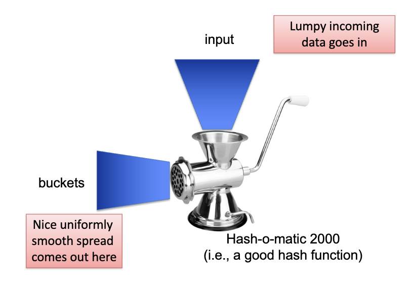

# The Hash Table

We will now examine a data structure that is O(1) for deletion and lookup, but unsorted. A hash table is just a vector of `n` slots, where each instance is perhaps a struct instance or a pointer to one.

A hash function takes a key value and calculates a bucket index, but we don't care about locality. We do not care if the keys are close (locality), in fact spread is a good thing.

## A Simple Example

Let's think about a simple student table where each student has a key. 

You tell me the last three digits of the student number, and I will put the record in that bucket. What's the problem? A __collision__ occurs if two different elements map to the same bucket (the same hash).

## Collisions

You might say, collisions are statistically improbable. Quite the opposite. If 2500 keys are hashed into 1,000,000 buckets, even with a perfectly uniform random distribution, according to the "birthday problem" there is a 95% chance of at least two of the keys being hashed to the same bucket.

## Resolving Collisions

Closed Hashing
- Use some strategy to find another bucket in the table
Open Hashing
- Each bucket is actually a ptr to short linked list (or BST) of records

For insert, if the desired bucket is full, just go to the next one and the next one until you find an empty slot. This is called closed hashing using linear probing.

# Closed Hashing

If there is a collision keep adding one to the index

Deletions mean marking the bucket as a zombie. Zombie buckets can be repurposed for new data on insert, so the zombie flag strategy (rejected for BSTs) are a reasonable strategy here.

## The Linear Probing Method

On lookup, start in the bucket that hash function tells you to go to, then
start probing until you find the target, or nothing.

- N == number of (non-zombie) records/elements currently stored
- K == number of buckets in table
- Note that N <= K must be true for closed hashing
- There are other "probing" approaches for finding the next place to look, using a secondary (& tertiary, if needed) hash function

If N << K this can work well, at the cost of some wasted space.

### Problems

It's bounded in the number of possible elements we can store (unless we grab a bigger vector and copy over every so often, which we totally could do).

As N (# of records) approaches K (# of buckets), insert takes longer and longer.

In addition, the zombies should be overwritten in future inserts. Every so often, build a new hash table with the only the non-deleted (non-zombies) values from the old table.

## The Cost of Closed Hashing

"Linear probing" means keep adding to the index. There are other probing techniques for finding the next place to try if you have a collision in closed hashing.

Typically, with closed hashing, you allocate space for all of the table entries in the table itself at the beginning of execution

If the table is mostly empty much of the time, this is wasteful but you don't have to allocate new Nodes with each insert, which may be nice.

As the table gets full, you will end up with more and more probing being done to add a new element.

If the table is 95% full, you have only a 5% chance of hitting an available bucket on the first try.

# Open Hashing

We'll borrow the LOL (list-of-lists) idea from our priority queue implementation. Each bucket holds a ptr (to a list) rather than an element. This is called open hashing with chaining.

## Chaining

We'll keep the overflow mini-lists unsorted, as we really hope that they will be short. However, we could keep them sorted, or use a BST (like Java's HashMap).

However, if the lists are long enough that this makes a real difference, then you probably need to enlarge the number of buckets or rethink your hash function!

## The Problem

You see, the same problem persists. Basically, once you have a collision, you have to use some other strategy. It is constant time to find the right bucket, but to find the right element in that bucket, it takes O(m) or O(log m) depending on the DS you use.

With open hashing, there's no hard cap; you can keep using the same table as the number of elements far exceeds the number of buckets.

__Best Case__
- No collisions, O(1) lookup (requires N <= K)

__Worst case__
- All inputs map to same bucket, O(N) lookup

Then there is always the chance there are hidden patterns in the data we failed to see.

# The Hash Function

The core of the hash map comes down to the hash function.

1. Deterministic (this is absolutely necessary)
    - Value is based entirely on manipulating the key value
    - Must always get the same answer for the same input (or lookup will fail later)
    - Instead, we want to take some intrinsic property of the input data that feels random
2. Good Spread
    - Patterns in the input do not relate to patterns in the output, if any.
3. Cheap to Compute
    - O(size_of_key), but ideally independent of # of elements in table
4. Supports a Variable Range
    - Easy to adapt if the number of buckets changes

## Hashing

Hashing does not require that elements have unique key, but each distinct key value will map to the same bucket. Hashing doesn't work well if you want to find all elements in a range of values.

Human names and natural language words are very lumpy in their distribution. The spread is very hard to achieve 

One commonly suggested hash for character strings is sum the ACSII values of the characters, then mod K.

This is a __horrible__ hash function. It was suggested in the original edition of The C Programming Language by Kernighan and Ritchie (aka K&R).

# Performance of Hashing

There are two basic solutions.

1. Devise a better hash function
    - Need to study the data, run experiments, read some math books, etc.
    - Good hash functions can greatly improve performance, but we already have some great, well-known functions like SHA1

2. Increase the number of buckets
    - You waste space if you keep adding
    - Some hash approaches double the table in size every so often
    - Adding more buckets may not help much if your hash function is terrible

