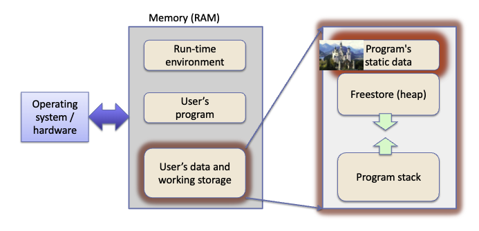

# Uniform Initialization

C++ features new syntax for initializing members of a class. We can use brackets to give arguments to constructors.

1. Default Init
```cpp
T t1;
T* t2 = new T;
```

If T is a primitive data type, space is allocated for the variable on the stack, but the value is random garbage. If T is a class, the default ctor is called.

2. Value Init
```cpp
T t1 {};
T* t3 = new T {};
T* t4 = new T ();
```
If T is a primitive, __zero-initialize__. If T is a class, carry out default init, but if the default ctor is deleted or not user-defined, then __zero-initialize__.

3. Zero Init
Unlike the above, zero init is a specific step the compiler takes. It is not a syntax you can call by name like a function.

If T is a primitive, set to zero (false, nullptr, 0, etc.). If T is a class, zero-initialize all base classes (inherited parts) and data members (newly defined), if any.

# Designing a Constructor

We already know what constructors are, let's take the Balloon class and design a second class that models a Child who always has a name and sometimes has a Balloon.

You might say that's very easy, but let's list considerations before we touch any code.
- How should we model "has a name"?
- How should we model "receives/has/loses a balloon"?
- What (and how many) ctors should we include?
- What do we do with the Balloon when a Child dies?

## Version 1

Balloon as a sub-object of a child.

```cpp
class Child {
    public:
        Child();
        Child(string name);
        Child(string name, string bColour);
        virtual ~Child();
        void speak() const;
        Balloon balloon; // public fields are a bad idea FYI
    private:
        const string name;
};

Child::Child() : name {"Les Doe"}, balloon{} {}
Child::Child(string name) : name {name}, balloon{} {}
Child::Child(string name, string bColour) : name{name}, balloon{bColour} {}
```

Version 1 is a good design, but does not match our standards. Having balloon as a stack rather than heap allocated object is a good idea, because in general if an object dies, its subobjects die as well.

Assuming each child has a unique, unpoppable balloon, this implementation seems to fit our design well since balloons are created when child is created, balloons never pop on their own, and no child has more than one balloon.

However, this design fails to model a balloon-less child. If we instead allocate the balloon on the heap, we can use `nullptr` to model the state of not having a balloon.

We implemented this version in `child.cc`.

# Principle of Least Astonishment

API elements should not do surprising things. Each implementation of an overloaded function should do around the same thing, and that is not what happens in `child.cc`.

The first two ctors do not create a balloon, but the third one does, an inconsistency among overloaded methods. To enforce POLA, we can simply choose to not model the case where a child has no balloon. 

Maybe it would be better to always create a balloon in the ctor or never, on the other hand, we may wish to model the case where we create a
Child who has no Balloon, which seems to be a natural fit for the second ctor. Maybe a better way is to create a Child with just a name, and handle
Balloon transactions separately via other methods of Child.

Moreover, does it make sense to have ctors that set a default name and Balloon, particularly because one is const and the other isn't? Not really! Then, should we remove the first constructor of no arguments, and divide constructors into a ctor for name and a ctor for balloon?

What do you think is the right design pattern here? There is no correct answer.

# Static Fields and Members

To start, we will define some additional OOP terminology.

1. Member Variable / Field
- An instance variable (one per instance of a class)
- A class / static variable (one per class)

2. Member Method
- An instance method which operates on `this`
- A class / static method, which does not operate on any instance, and cannot call instance methods inside a static method. However, this method can edit static methods, and directly change static variables. Can access objects of the existing class iff they are passed to it as parameters.

A new instance variable is created for each object instance. Its value can change independently of the other instances over the lifespan of the object.

An instance method may look at or change the instance variables of that object (as well as the static / class vars).

A __static variable__ is different because there is only one of them. A static method often exists to manipulate static variables of the same class only.



Scope-wise, static members live in the class they are defined in. They are declared in the class declaration along with all other methods. Outside of the class, they are referenced like `className::staticMemberName`.

Sometimes, we use `static` to track metadata and how many instances are currently active. In production, static types aren't used that much, other than universal constants and enum types.

I mean, if there's only one universal value for the constant, why store a copy of it with every object when you can store it in one place, in the actual static storage?

## More Balloons!

Take a moment to convince yourself that there are 2 balloons created in the runtime stack of main in `balloon_nums.cc`.

However, the output is 1. Why? The reason is we called the copy constructor, but we never attached anything to it.

# Copy Constructors

You can define as many ctors for a class, and you can always overload ctors. This means that each ctor must be different from the others in the ordering of its parameters, otherwise the compiler might be confused.

There are also a few special ctors that we may wish to define:
- The default ctor (we've seen it)
- The copy ctor (you get one defined for you for free, but you can also define it yourself)
- The move ctor (seen later...)

```cpp
class Balloon {
    public:
        Balloon(); // Default ctor
        Balloon(string shellColour);
        // Balloon (string ribbonColour); // Nope
        Balloon(string shellColour, string ribbonColour); // OK
        Balloon(string c, int size); // OK
        Balloon(int i, string c); // OK (diff. ordering)
        Balloon(const Balloon &b); // "Copy" ctor
        Balloon(Balloon &&b); // "Move" ctor (CS247)

private:
    string shellColour;
    string ribbonColour;
    int size;
};
```

A copy constructor takes a `const` ref to existing objects as its argument, and it creates a copy of itself as a new object.

There is an implicit default copy constructor predefined for every class; it performs a memberwise copy construction (shallow copy).

For each subpart c of type C, call the (implicit or user-defined) copy constructor `C::C(const C &c)`.

Sometimes, memberwise copy construction is not the appropriate recipe; then you need to define your own customized copy ctor (eg. if you have ptrs to external objects that may be shared).

The usual advice is if your object involves dtor, copy ctor, or copy assgt operator, then you should include explicit definitions for all of them.

This is a fix to `balloon_nums.cc`.

```cpp
// Redefine the copy ctor to make the curNumBalloons count
// correct; we don't need to touch the dtor or operator= here
Balloon::Balloon(const Balloon &b) : colour{b.colour} {
    cout << colour << " balloon is cloned" << endl;
    curNumBalloons++;
}
```

# Destructors

A destructor is a special method which specifies how to clean up. Typically we need to specify our dtor if we have heap-allocated elements.

Although, if the class is part of an inheritance hierarchy, then we usually define our own dtor even if it does nothing interesting, and we declare it as virtual.

## Destructor Calls

You do not call a destructor. A destructor is called implicitly when an object's scope leaves or if delete is called to the object's ptr on the heap.

When an object dies, all sub-objects like primitive types, int, ptrs, etc. as well as sub-objects also have be destroyed.

Note that a stack-based sub-object might in turn have subparts on the heap (e.g., like a string does), but the sub-object's dtor should take care of that.

## Destructor Responsibilities

What if an object points to an object on a heap or some other structure you need some knowledge about the object's scope.

If you are the only one who knows about the heap object, then just delete it in the body of your destructor. If the object is shared, you need some sort of global agreement about who owns the object and what actually executes the delete.

## Ordering of Destructor Actions

When an object `obj` of class `C` is deleted,

1. `C::~C()` dtor body runs.
2. `obj`'s objects have their dtors invoked in reverse order.
3. The space for `obj` are deallocated.

## A Segmentation Fault Example

```cpp
int main (int argc, char* argv[]) {
    Child trev {"Trevor", "red"};
    Child* ian = new Child {"Ian", "yellow"};
    Child alex {"Alex"};
    trev.speak(); // "Trevor with a red balloon!"
    ian->speak(); // "Ian with a yellow balloon!"
    alex.speak(); // "Alex"
    ian->pBalloon = trev.pBalloon; // Bad behaviour
    delete ian; // Timeout!
    trev.speak(); // Undefined behaviour
} // Segmentation fault on destructing trev
```

If we define `Balloon* pballoon` as a public parameter, everything is fine until line 199. Basically, Ian's balloon is now Trevor's balloon.

First, Ian's balloon is isolated; we immediately get a memory leak. Second, when Ian is deleted, all of Ian's sub-objects (including the balloon he owns) have their dtors called.

Now Trevor's balloon is gone. Trevor's speak is undefined behavior. Since `trev.pBalloon` still holds the old address, which is a dangling pointer. It might be a nullptr, it might hold nonsense.

Most likely, calling Trevor's dtor causes a double free (segmentation fault). Let's see if our predictions are correct.

### Output

```
Trevor with a red balloon!
Ian with a yellow balloon!
Alex
Trevor with a  balloon!
Segmentation fault
```

Yes. Bad behavior followed by a seg fault, as predicted. This is why we kept balloon as a private field in the Child class, although this doesn't address the fundamental design flaws.

# Designing for Sharing

How do we handle object sharing, like a Balloon that might be owned by multiple Children during its lifetime?

We can try using a pointer. However, we need a good understanding of who owns the shared object and who is responsible for destructing it. The easiest method is to use a smart pointer like `shared_ptr`.

If we want to allow objects to change ownership, then we need some sort of transfer protocol. We probably need special methods (auth / confirmation) and we probably should't use a public field.

## Fine... I'll Do It Myself

By convention, we use struct methods when we want to group variables together in a meaningful manner, whereas classes are just enriched structs.

Maybe, it would be a good idea to let the class methods do the data management. Chances are, the guy who made the class knows better than the client!

Letter clients have arbitrary access to public member variables sounds bad, and in fact, it is not good at all. Would it not be nice to allow limited access, whatever that "limit" may be?

The use of something like set and get for the seg fault example solves the problem of a memory leak, but not the issue of who owns the red balloon. We would need a good assignment of responsibilities.

## Modeling the Real World

Modeling the real world feels a lot more natural than procedural programming. Indeed, with OOP, we can design API that correspond to what the external user expects, rather than providing raw access to underlying data.

The public API should model the expected protocol for use, which requires a good deal of thought about natural language of methods in appropriate usage scenarios.

For example, a use of `child_sr.cc` may see a `Child` can give or receive a Balloon. This is a lot more helpful than saying "a child has a `Balloon` pointer.

We talked about information hiding and abstraction (fundamental to programming in general) a while back when we introduced the Stack ADT. This is why Stack supports `push()` and `pop()` but not `at()`.

The point is, a class is meant to represent an object. Whatever that object may be, all methods play a role in describing the object to the external viewer.

The constraints on how `Balloon` can be used provide the user with an idea of how this class is meant to be used. 

Similarly, for a Stack, the constraints may hint that the stack is a LIFO list structure rather than a general storage container.
