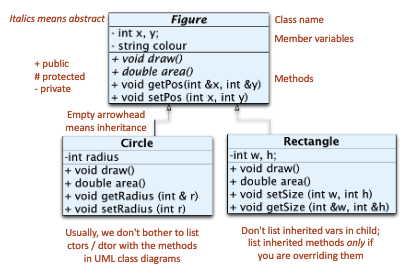
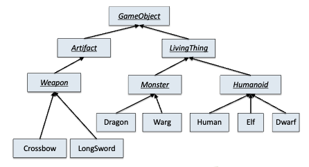
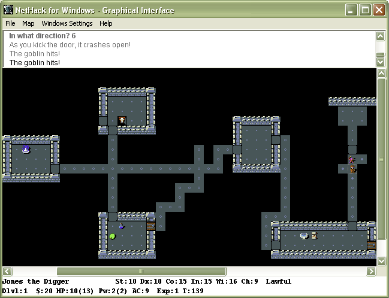

# Accessors and Mutators

Any method is either an __accessor__ or a __mutator__. An accessor gives value of some object, while a mutator changes the object (cannot be const). There is a special category of accessor and mutator pairs called getters and setters.

Simply put, we wrap CRUD functionality around private fields, allowing the user to edit without directly seeing the field. This is much better than setting potentially sensitive variables public for clients to see, but do not overuse this pattern; it gets very messy. An example would be React's `useState()`.

Exposing fields through public getters and setters defeats the purpose of information hiding.

## Ownership

Note the difference between Balloons and names. Names are trivial, while Balloons is a bit more interesting in terms of handling. Balloon has two mutators that we covered last time, the `giveBalloon` and `getBalloon`, and an accessor, `getBalloonColour()`

Using a get/set method pair for Balloons would work, but less natural for the problem (as in real life, we are transferring ownership).

## The `const` Pledge

A true accessor method (i.e. not a mutator) does not change its object, hence it makes sense to add const to its signature. The compiler will check that you do not modify anything! A const method cannot call a non-const method. For subparts that are objects, you can't change them!

Although, there are many, many ways to trick / override compiler behavior into allowing you to modify a const method.


If the subpart is a pointer, you are actually promising only not to change the mem address the pointer holds. You are allowed to change the subparts of any object you point to, including calling non-const methods (which breaks the spirit of the const pledge).

This is may seem surprising and maybe a little evil; but it's legal behavior.

# Recalling the Copy Ctor

Let's define two copy ctors.

```cpp
Balloon::Balloon (const Balloon &otherBalloon) : colour {otherBalloon.colour} {}
Child::Child (const Child &otherKid) : name {otherKid.name}, pBalloon {otherKid.pBalloon} {}

int main (int argc, char* argv[]) {
    Child dolly {"Dolly", "red"};
    Child d2 {dolly}; // Use default copy ctor
}
```

What will happen when I run `main`?

A segmentation fault. How? Consider Child dolly, with a pointer to a red balloon. When we use the __default__ copy ctor to create d2 on the RTS, we are copying by value. After all, we never specified any special behavior in our copy ctors, and most importantly we are initializing a copied child with the __same__ balloon pointer as the starting child!

What this means is, when the stack items are deleted, d2 is deleted and when dolly is deleted, the default dtor attempts a double free on the balloon which was already deleted.

## A Deep Copy Alternative

We will talk about deep and shallow copies later, but clearly the fix is actually copying the object rather than the reference to the balloon during copying. We can do that.

```cpp
Child::Child (const Child & otherKid) : name{otherKid.name}, pBalloon{new Balloon {*otherKid.pBalloon}} {}
```

Now, each new copy will create a new balloon of the same color as the source. Let's think about how we can cause a bug using this copy ctor.

```cpp
int main (int argc, char* argv[]) {
    Child dolly {"Dolly", "red"};
    Balloon* myRedBalloon = dolly.giveAwayBalloon();
    delete myRedBalloon; // pop!
    Child d2 {dolly};
}
```

Again, a seg fault occurs, and here it is much clearer why.  After dolly gives away their balloon, the Child d2 is attemping to dereference a nullptr during the deep copy. So we need to check if `otherKid.pBalloon` is a nullptr.

```cpp
Child::Child (const Child & otherKid) : name{otherKid.name}, pBalloon{nullptr == otherKid.pBalloon ? nullptr : new Balloon {*otherKid.pBalloon}} {}
```

Yes, initialization lists get complicated. We could have also let the compiler implicitly call `pBalloon` and assign the same ternary in the body of the copy ctor.

## Versions of the Copy Ctor

```cpp
Balloon rb {"red"}; // 1
Balloon rb1 {rb};   // 2
Balloon rb2 = rb;   // 3
rb1 = rb;           // 4
```

1. Calls normal ctor.
2. Calls copy ctor.
3. __Calls copy ctor.__
4. Calls `Balloon::operator=`

For (4), you can choose to use the default assignment operator or define your own `Balloon& Balloon::operator=(const Ballon& b)`. Also, you should probably define the same behavior for both copy and assignment ctors - we will talk about the rule of the big 5 later.

## Calling the Copy Ctor

The copy ctor is implicity called when...

1. An object is init by another object of the same class.
2. An object is passed by value to a method or function.
3. The object is returned by a fcn, although the compiler may forward the object instead of copying it!

There are exceptions as of C++11.

Taking a look at `cpy_balloon.cc`, we notice the Balloon copy constructor is effectively called when it is passed by reference, when it is initialized, and when it is returned.

```
normal ctor: red
copy ctor: red
normal ctor: red
copy ctor: red
normal ctor: red
copy ctor: red
copy ctor: red
normal ctor: red
copy ctor: red
copy ctor: red
```

The output is as we expect.

Fun fact, output using the `-fno-elide-constructors` compiler flag forces the compiler to be "dumb" and make all of the objects you would naively expect. There is no reason to use this for now.

# Rule of the 5

If we have a customized copy ctor, we probably need to define a custom dtor as well. The Rule of 5 says if you have a custom definition for any of the copy ctor, dtor, or operator=, then you need custom definitions for all three of them.

The other 2 are the move ctor and the move assignment operator, which we will not discuss. C++11 adds move semantics, allowing objects to acquire sub-parts from temporary objects.

## Shallow Copy

If b is an object of class C, then C's copy ctor performes the shallow copy. The default copy ctor, you get for free (`C a = b;`). That is, for every part of subpart `x`, it copies from `a` to `b`.

Remember for each subpart x, we call their copy ctor as well. If x is a scalar, we copy their value. If x is a pointer, we copy the pointer value, regardless of what it might point to.

## Deep Copy

An alternate strategy is to use the deep copy. For objects and scalars, do the same as a shallow copy. If we run into a pointer, we create a deep copy of that as well. This means a deep copy will recursively create copies of the referenced objects, rather than just copying the references.

Thus a deep copy can be seen as a true copy; modifications to one will not affect another. Analogy would be sharing a Google Doc (shallow) versus copying the doc (deep).

Deep copies can be used in copy ctors and the operator= as well. If you decide to use deep copy for the copy ctor, probably keep the copy deep for both.

# Overloading

As we saw with `Balloon` ctors, sometimes it is convenient to have multiple definitions of a method that differ in the parameters they take. We mentioned overloading earlier for the default ctor; it is very common for libraries, to maximize flexibility, but they need to explicitly take in different params.

```cpp
class Balloon {
public:
    Balloon(string colour);
    ~Balloon();
    void speak();
    void speak(string extraMsg);
    void speak(ostream & os);
    void speak(ostream & os, string extraMsg);
private:
    string colour;
};
```

The usual reason why we overload an element is to have some flexibility in how the method is called. After all, there are many cases.

```cpp
class ComplexNumber {
public:
    // ... ctors etc.
    ComplexNumber& operator+(const ComplexNumber & c);
    ComplexNumber& operator+(int i);
    ComplexNumber& operator+(double i);
    ComplexNumber& operator+(float i);
    // ...
};
```

A common design pattern is to structure implementation around some general method that does most of the work, and other methods just makes trivial calls to it.

## A Repetitive Overload Example

```cpp
// Balloon::speak() design #1: verbose & repetitive
void Balloon::speak () {
    cout << "I’m a " << colour << " balloon!" << endl;
}
void Balloon::speak (string extraMsg) {
    cout << "I’m a " << colour << " balloon!" << endl;
    if (extraMesg.length() > 0 ) {
        cout << extraMsg << endl;
    }
}
void Balloon::speak (ostream & os) {
    os << "I’m a " << colour << " balloon!" << endl;
}
void Balloon::speak (ostream & os, string extraMsg) {
    os << "I’m a " << colour << " balloon!" << endl;
    if (extraMesg.length() > 0 ) {
        os << extraMsg << endl;
    }
}
```

# A Cleaner Overload

```cpp
void Balloon::speak(ostream & os, string extraMsg) {
    os << "I’m a " << colour << " balloon!" << endl;
    if (extraMesg.length() > 0) {
        os << extraMsg << endl;
    }
}

void Balloon::speak() {
    speak(cout, "");
}
void Balloon::speak(string extraMsg) {
    speak(cout, extraMsg);
}
void Balloon::speak(ostream & os) {
    speak(os, "");
}
```

Notice, we are using a function to overload other functions! This is a valid, and often preferred method of overloading, offering a greater degree of abstraction.

## Overloading and The Compiler

The compiler considers that there is one method here, `Balloon::speak()`, with four possible definitions. We would see 4 overloads.

The compiler looks at each call to `Balloon::speak()`, and (statically, at compile time) figures out which definition to call based on the number and types of the arguments used by the caller. That's how the compiler distinguishes overloads.

We can also overload operators, and that is the real start of infinite despair. Have fun with that when your `[]` has 21+ overloads.

For that reason languages like Java do not support operator overloading.

# Constructor Delegation

Formerly, we mentioned constructor delegation, a technique where a ctor calls another ctor. This is supported as of C++11. The idea is to design a general function, including all possible ctor functions, and design other ctors to return special cases of the general function.

The client can call one ctor, but the ctor will in turn call another ctor. We have no example yet, but this is absolutely valid and advised for general-purpose classes.

```cpp
class Balloon {
public:
    Balloon();
    Balloon(const Balloon& that);
    Balloon(const string& colour);
    void speak() const;
    virtual ~Balloon();
private:
    string colour;
    static const string DefaultColour;
};

const string Balloon::DefaultColour = "grey";

// Default ctor (which calls general ctor)
Balloon::Balloon() : Balloon {DefaultColour} {}

// Copy ctor (calls general ctor)
Balloon::Balloon (const Balloon& that) : Balloon {"pale " + that.colour} {}

// This is the general ctor
Balloon::Balloon (string colour) : colour {colour} {
    cerr << colour << " balloon is born" << endl;
}
```

Unlike the previous overloading example (constructors call a version of themself) this is a constructor calling another constructor!

Some functions have no definition, we call them abstract fcns in Java and pure virtual classes in C++.

In C++ we call a class abstract if it contains at least one pure virtual class. A concrete class is the opposite of a virtual class, meaning it can be directly instantiated.

All classes we implemented so far are concrete classes.

# Access Rights

| Access Modifier | Accessability |
|-----------------|---------------|
| `public`        | Anyone may access these parts, including external clients. |
| `private`       | Only my methods and those of my __inheritance descendants__ may access these parts. |
| `public`        | Only my methods may access/use these parts. |

Do note, access does not imply visibility. `private` parts are visible in children, and children can even redefine `private` parts (pause). However, children cannot use or call inherited private variables and methods. 

`friend` classes and functions may also access all parts. More on `friends` later.

# General Object-Oriented Design

As mentioned before, each class should implement a single coherent abstraction of something.

1. The public elements specify what the class designer thinks external clients (users of the class) should see, and how they should think about using the abstraction.
2. The private elements (variables, maybe some methods/constants) are the implementation secrets only the class itself knows about and can manipulate. These could be secrets or simply irrelevant details that do not need to be seen.
3. The protected elements are implementation secrets that are shared with the inheritance descendants.

A __leaky abstraction__ (violation of _encapsulation_) occurs when implementation details become exposed in the API, like a Stack which somehow gives users direct access to all of its contained elements.

For example, we can implement a Stack using a vector, or using a linked list (be careful, a user could use `struct Node`). However, we can really improve the encapsulation if we make `struct Node` a private member of Stack.

```cpp
class Stack {
public:
    Stack();
    virtual ~Stack();
    bool isEmpty() const ;
    void push(string s);
    void pop();
    string top() const ;
private:
    struct Node; // details below
    Node* first;
};

// Prevents others from accessing implementation details
struct Stack::Node {
    string val;
    Node* next;
};

int main () {
    Stack s;
    s.push ("hello");
    s.push ("there");
    s.push ("world");
    cout << s.top() << endl;

    // this is now illegal!
    Node *p = new Node {};
}
```

Now, `Node` instances can only be referred to by methods containing Stack. This approach improves encapsulation.
- Expose only the essential abstraction in the public part
- Hide inessential details from external clients by making them private

## Nested Classes

We've seen that variables, methods, and even types and constants can be put inside a class, and marked as public, protected, or private.
- Methods of that class and those of its inheritance descendants can refer to these as just PartName
- External clients must say ClassName::PartName or someObject.partName instead, and can only access public parts (unless they are a `friend`)

If a class is the only user of a helper class / struct (like Node), we can restrict access to the helper class by making it a private subpart of the container class.
- A nested class is like a normal class in every way, except the access rights are specified by the containing class.
- A client should not have to think about the helper at all! There is no point knowing about the specifics of `Node`.

# Inheritance



What you are seeing is a general-purpose, object-oriented visual modeling language known as UML (unified modeling language). The above diagram tells us much we need to know about iinheritance.
1. Classes can extend to other classes.
    - Inherit ancestral variables and methods.
    - Add new variables and methods.
    - Override inherited behavior.

2. Inheritance Hierarchy (Tree)
    - Leaf classes are usually concrete.
    - Internal / root classes are usually abstract.
    - Instances can be polymorphic.

Notice how these child classes take the abstract methods from their parent (draw, area) and implement them for their specific case. That's the power of inheritance. We can organize similar classes in a hierarchy, but also specialize them in their own hierarchy.

Which is why, we often have a collection of classes that have a lot in common but also have some important differences. Let's consider a computer game where there are different kinds of humanoids, monsters, and weapons. 

These can be grouped by type, but also by functionality, like weapons must be displayable in the player's hotbar. Monsters could be split into neutral and aggressive, with sub-branchs specifying monsters by class, pathfinding algorith, or chase sequence.

We can take advantage of these potential commonalities by putting common bits into an abstract parent class, and let the other classes specify their own behavior. There is less repeated code, errors are more tracable, and that makes the design easier to maintain.

## An Example Hierarchy



Notice how we assume leaf node classes are concrete, and internal node classes are abstract. Also, note that the arrowheads for crossbow should be empty. We could have a general class for projectile-based weapons, and another general class for projectiles, and make projectile-based weapons have pointers to the projectiles they support. We can overload the load function to support multiple projectiles for a single weapon.

For example, Necron's Blade can have any of the three Wither Scrolls, as well as Wither Impact when all three scrolls are applied. Then Necron's Blade can also be further refined to the four Wither Blades, retaining the Wither Scroll abilities. 

If you know, you know. Just an example of how inheritance is used in video games.


