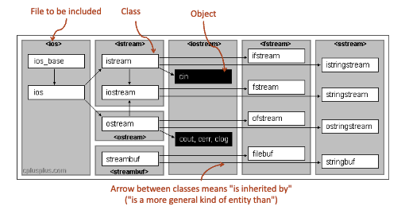

# Character Strings in CS138

Strings in C++ are NOT character arrays (C strings). C++ strings are declared by the `string` type. Character strings in C are impemented as an array of `chars` with an extra null terminator.

Strings support catenation and comparison based on standard lexicographical order.

| Operation / Method | Description |
|--------------------|-------------|
| `+` | String concatenation |
| `==`, `<=`, `<`, `>=`, `>` | Comparison based on standard lexicographical ordering |
| `s.length()` | Returns the number of characters in `s` |
| `s.at(i)` | Returns the `i`-th character (checked access; throws on out-of-range) |
| `s[i]` | Returns the `i`-th character (unchecked access) |
| `s.c_str()` | Returns the C-style `char*` equivalent of `s` |
| `s.substr(i, n)` | Substring of `n` characters starting at index `i` |
| `s.substr(i)` | Substring starting at index `i` to the end of `s` |
| `s.find(str, pos)` | Returns first index of `str` in `s` at or after `pos` |
| `s.rfind(str, pos)` | Returns last index of `str` in `s` at or before `pos` |
| `s.replace(...)` | Replaces characters within `s` |
| `s.insert(...)` | Inserts characters into `s` |

## `char` vs `string`

You can access individual characters of a string either
- unchecked like an array access e.g., s[2], or checked via the at method e.g., s.at(2)

In either case, what you get is a single char, rather than a string of length 1. Accessing vector elements is similar, as we'll see.
- Chars are both characters and integers.
- When you use the "+" operator on chars, it performs integer addition, not string catenation.
- When you print a char, you get the character not the integer

## 'a' vs "a"

`'a'` is a single character, but `"a"` is a string literal. You can't add string literals, because string literals are not string values. They are equivalent to `const char*`.

```cpp
#include <iostream>
#include <string>
using namespace std;

int main (int argc, char* argv[]) { // Output
    cout << "m" << endl; // m
    cout << 'm' << endl; // m

    cout << (int) 'm' << endl; // 109

    string s1 = "m";
    string s2 = "g";

    cout << s1 + s2 << endl; // mg
    cout << "m" + "g" << endl; // **error

    // but if you cast a string type, it creates a temp object using the string literals
    cout << (string)"m" + (string)"g" << endl; // mg
    cout << (string)"m" + 'g' << endl; // mg

    cout << 'm' + 'g' << endl; // 212(=109+103)
}
```

## String Equivalence?

The C++ `string` class defines the equality operator to work as expected. `s == t` is true if and only if `s` and `t` has strictly the same characters in the same order.

# Command Line Arguments

There are two arguments in main, and their values are accessible.

- argc, an int which counts the # of command-line args passed to the executable for that particular run
- argv, an array of char*, one for each arg passed in for that run
- argc and argv can be different each time the (same) program is run!

`argc` has at least one element and `argv[0]` contains the name of the command used to call the program.

```nginx
$ ./myprog -flurble blat
```

- `argc = 3`
- `argv[0] == "./myprog"`
- `argv[1] == "-flurble"`
- `argv[2] == "blat"`

## Terminal Tests

```bash
q95li@ubuntu2404-012:~/cs138/notes/lec2$ ./echoCommandLine hello
argc = 2
argv[0] = "./echoCommandLine"
argv[1] = "hello"
q95li@ubuntu2404-012:~/cs138/notes/lec2$ ./echoCommandLine "hello world"
argc = 2
argv[0] = "./echoCommandLine"
argv[1] = "hello world"
q95li@ubuntu2404-012:~/cs138/notes/lec2$ mv ./echoCommandLine cmdline
q95li@ubuntu2404-012:~/cs138/notes/lec2$ ls
argvc.cc  cmdline  stringops.cc  strings.md
q95li@ubuntu2404-012:~/cs138/notes/lec2$ ./cmdline flurble
argc = 2
argv[0] = "./cmdline"
argv[1] = "flurble"
q95li@ubuntu2404-012:~/cs138/notes/lec2$ 
```

# Simple I/O

`#include <iostream>` gets you three useful streams. `cin`, `cout`, `cerr`. The operators are `<<` for output and `>>` for input. Recall that these are the bit shift operators, but they have been overloaded to return the input stream.

See `stdio.cc`.

## Read up on <iomanip> which offers many output stream formatting options.
(http://www.cplusplus.com/reference/iomanip/?kw=iomanip)

## Input Whitespace

`cin <<` skips all intermediate whitespace, including space, tab, and newline characters. If you want to preserve whitespace, use `getline(cin, str)` instead. You'll have to parse the input string yourself.

## Detect EOF

1. Count the number of input items ahead of time, and put that number at the front of the input file, to be read in first
2. Use a dummy/sentinel "impossible" value after the last normal entry (e.g., name == "DUMMY" or studentNumber == -1)
3. Let the language and run-time do the work for you! The good news in C++ is that this is taken care of for you magically by the runtime; you just have to check if the eof flag has been raised for your input stream (e.g., cin).

We need to check if `cin.eof()` is true. Even better is to check `cin.fail()`. These can be used in other input streams, even in the terminal. You need to check right after.

### Example 1
```cpp
#include <iostream>
using namespace std;
int main (int argc, char* argv[]) {
    double sum = 0;
    int count = 0;

    while (true) { // awkward but correct version
        double next;
        cin >> next;
        if (cin.fail()) { // or “if (!cin) {“
            break; // break out of loop w/o using next
        }
        sum += next;
        count++;
    }
    // Note that cin.fail() could have been triggered by
    // either cin.eof() being true OR trying to read a
    // non-number found in the input stream into a variable of
    // type double (or possibly some other problem too)
    if (count > 0) {
        cout << "Avg is " << sum/count << endl;
    }
}
```

And we can also do a better version.

### Example 2
```cpp
#include <iostream>
using namespace std;

int main (int argc, char* argv[]) {
    double sum = 0;
    int count = 0;
    double next;
    // "cin >> next" returns "cin" as its value, which in turn
    // returns "!cin.fail()" when co-erced into a bool
    while (cin >> next) {
        sum += next;
        count++;
    }
    if (count > 0) {
        cout << "Avg of " << count << " numbers is " << sum/count << endl;
    }
}
```

We can also complexify the behavior.

### Example 3
```cpp
#include <iostream>
using namespace std;

// This will print all of the ints in the input stream cin
// and just ignore all of the non-ints
int main (int argc, char* argv[]) {
    int i;
    while (true) {
        if (!(cin >> i)) {
            // So the cin.fail() is true, but is that due to
            // eof or because the token wasn't an int?
            if (cin.eof()) {
                break; // if it was EOF, we're done!
            }
            cin.clear(); // if not, clear the fail bit
            cin.ignore(); // and flush current input token
        } 
        else { // read was OK, input token was an int
            cout << i << endl;
        }
    }
}
```

`eof()` and `fail()` can be used in other input streams, as we will soon wee. In fact `eof()` is a type of fail, called the end of file fail. We typically do not mix both, and use `fail()` as a general detection method.

We can also treat `cin` as a boolean as a shorthand to check if `cin.fail()` is true. See line __137__.

Finally, note that `eof()` and `fail()` don't return true until you go too far. This is why you must check right after an attempted input, but before you use that variable.

## Input Marker and EOF

Remember `getline()` means read each newine, including non-new line and whitespace characters. Set the EOF flag for the stream to true. See `richard3.cc` ('.' to represent spaces, <NL> tags and <EOF> tags added for clarity). Notice that `getline()` is a __delimiter__ based function, stopping only at a newline. `cin` stops at any whitespace.

To test the file, know how to redirect IO streams in Unix.

## Redirecting IO Streams in UNIX
```
$ g++ -o r3 richard3.cc
// Compile the file to executable named myprog

$ ./r3
// Enter input (cin) directly by kbd, use CNTL-D to indicate EOF;
// output (cout, cerr) shows up on screen

$ ./r3 < richard3.txt
// Std input (cin) is taken from (existing) file myinput.txt
// instead; output (cout, cerr) shows up on screen

$ ./r3 < richard3.txt > denouement.txt
// Std input (cin) is taken from file richard3.txt
// Std output (cout) is sent to file denouement.txt
// (this destroys old contents of denouement.txt, if any)
// Std error output (cerr) show up on the screen
```

### How does `cin` work?

We wrote something similar to `cin`'s general functionality in CS137, when we wrote code to skip all initial whitespaces to the next non-WS char, if it exists. Then, read each non-WS char into the input var `flurble`, stopping right before the next whitespace.

However if we do not find a next whitespace, we set the EOF flag for `cin` to true. `flurble` will no longer have a valid value value after this read. This is why the EOF flag is not set to true until after the first failed read; the input marker doesn't actually hit the end of file until then.

Hence we say the `EOF()` fail is a special case. The above logic is almost always true, but there are very picky edge cases. See `nitpick.cc`.

The `cin` uses a buffer stream and a pointer. When the pointer reaches the end of the input, the input stream can have more inputs and insert the new inputs into new variables.

When we input `123hello` the input stream reads 123 as a valid number, but the pointer is not at the end. The rest of the input is moved to flurble. Then we reach the end of input.

# File I/O

Suppose we want to set up a pipeline for processing data streams, and the inputs come from specific files, and the outputs are written to other special files.

If you wanted to hard code the names of the input and output files, use `fstream` instead of `cin` and `cout`.

The library classes ifstream and ofstream can be instantiated to get easy file-based IO using file stream objects.  You can't use filename directly in IO statement; instead, must create a stream object first and associate it with the file name, then use that stream
- Need to check right away that the stream creation was successful
- If stream creation fails, (e.g., input file not found, don't have correct permission to write to proposed output file), then myin.fail() will return true

Once created, we can use << or >> on the stream object.

See `transcript.cc`.

## Opening and Closing IO Streams

- Connect stream to a file.<br>`ifstream myin {"input.txt"};`
- Create a stream and connect it later.<br>`ofstream myout; myout.open("output.txt");`
- Close up the streams when we're done, and maybe connect to a different filename if we want.<br>`myout.close(); myout.open("output2.txt");`

# The Stream Hierarchy

What are `cin`, `cout`, and `cerr`? They are global vars that are defined for any program that uses iostream.
- cin is just an instance of the C++ Standard Library class istream
- cout, cerr are instances of ostream
- They are declared in the std namespace, so if you don't say "using namespace std;" then you have to refer to them as std::cin, std::cout, and std::cerr in your code.

What if we want to be able to read and write to a file __or__ one of the standard output streams? We can use `istream` and `ostream`.

### Example of `istream` and `ostream`
```cpp
// Example adapted from Adam Roegiest
#include <string>
#include <iostream>
#include <fstream>
using namespace std;

// The ampersand (&) means "reference parameter" (coming soon!)
void printAnswer(ostream &output, string answer) {
    output << "The answer is " << answer << endl;
}

int main (int argc, char* argv[]) {
    printAnswer(cout, "67"); // cout, cerr are ostreams
    printAnswer(cerr, "Mason x TK");

    ofstream myout {"foo.txt"};
    if (myout) {
        // print to the file now; myout is an ofstream,
        // and ofstream inherits from ostream
        printAnswer(myout, "must have been the wind");
    }
}
```

In fact `cout` and `cerr` are instances of `ostream` while `myoutfile` is an instance of `ofstream`. This is because the class of `ofstream` inherits from `ostream` and `ifstream` inherits `istream`.

The assumpted type of these sub-streams is `istream` or `ostream`, and this is called polymorphism, although, this will be post-midterm material.

[](http://www.cplusplus.com/reference/iostream)

# String Streams

You know the drill. Use `<<` and `>>`, and to access string elements, use `istringstream` to read from a string and `ostringstream` to write to a string.

```cpp
// Convert an int to a string cleanly
string intToString(int n) {
    ostringstream oss;
    oss << n;
    return oss.str();
}
```

## Example 1
See `ss.cc`. The output is recorded below.

```bash
$ g++ -o sstream1 sstream1.cc

$ ./sstream1
Enter an integer: 34
You entered 34

$ ./sstream1
Enter an integer: hello
Ooops, try again

$ ./sstream1
Enter an integer: 3.14
You entered 3
```

Notice that the input `3.14` was rounded to the nearest integer 3. The reason is because 3.14 is a string, and 3 was extracted first, but "." is not a number, so the loop breaks.

## Example 2.
See `ss2.cc`. Again, the program looks confusing, but all it does is feed stuff into string `s` and then ask if we can pull an integer out of each individual string stream. If possible, print the integer.

Using what we did above, we can recreate a UNIX command called `grep`. What `grep` does is reveal every line in a file that contains a certain word. 

```bash
q95li@ubuntu2404-012:~/cs138/notes/lec2$ grep rounded < strings.md
Notice that the input `3.14` was rounded to the nearest integer 3. The reason is because 3.14 is a string, and 3 was extracted first, but "." is not a number, so the loop breaks.
```

## Example 3
See `greep.cc`. Try running these commands, and notice the similarities. The only difference is that `grep` finds substring instances and full matches, while our knockoff `greep` only finds full matches.

```bash
$ g++ -o greep greep.cc

$ grep line < greep.cc
string line;
while (getline (cin, line)) {
istringstream s {line};
cout << line << endl;
// Don't print the line again!

$ ./greep line < greep.cc
cout << line << endl;
// Don't print the line again!

$ ./greep "line;" < greep.cc
string line;
```

## Alternatives to `sstream`
`std::string::stoi()` can convert a `std:string` to `int` and there are also versions for floats, doubles, etc.
There's also a method `std::string::to_string()` that converts a number (int/float/double) to a string.

```cpp
#include <iostream>
#include <string>
using namespace std;

int main (int argc, char* argv[]) {
    double pi = 3.14159;
    string pi_msg = "pi = " + to_string(pi);
    cout << pi_msg << endl;

    string s_numLuftballons = "98";
    int numLuftballon = stoi(s_numLuftballons);
    cout << "Nena singt über " << numLuftballon + 1 << " Luftballons" << endl;
}
```
