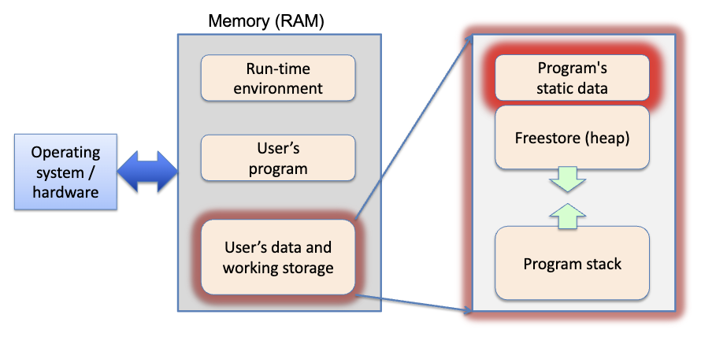

# Algorithms and Container Methods

BY using iterators, we usually need to define only one version of an algorithm.

The point is, there is no one algorithm for everything. There are stand-aloine algorithms in many different STL containers. Red means _there's a stand-alone implementation of this method_. In addition, the implementation of these containers differ. 

Let's take a look at some methods in the algorithm library.

```cpp
#include <iostream>
#include <string>
#include <vector>
#include <algorithm>
using namespace std;
int main(...) {
    vector<Figure*> v{};
    std::random_shuffle(v.begin(), v.end());
    vector<string> wordList();

    // ... add stuff to wordList
    std::sort(wordList.begin(), wordList.end());
    string s = "edcba"; // strings are like char-vectors

    // changes made in place
    std::random_shuffle(s.begin(), s.end());
    cout << s << endl; // Random ordering of the chars

    std::sort(s.begin(), s.end());
    cout << s << endl; // "abcde"
}
```

## Useful Algorithms

- `find` locates the first element that "matches" a given object
- `count` counts the number of elements that "matches" a given object
- `for_each` applies a function to each element
- `remove` removes all matching elements
- `replace` replaces all matching elements with a specified new object
- `sort` sorts the elements
- `unique` removes adjacent "identical" elements (useful if elements are already sorted)
- `min_element`, `max_element` ...
- `nth_element` , ...
- `random_shuffle`, ...
- `next_permutation` can cycle through all N! permutations of an ordered container!

Just to be sure, we can use `next_permutation` to sort a container. By the way, this sorting algorithm is __O(n!)__. Took around 2.4 million iterations to get the sorted container.

# Polymorphism and Dynamic Dispatch

Moving back to OOP after a little incursion into the algorithms library, let's review.

- Classes define member fields (variables) and methods.Object instances can be created from classes.
- Methods operate on the fields (and parameters).
- public methods describe the client's API.
- private fields / methods implement some of this API within the class.
- protected fields / methods share rest of work within the family.
- Leaf classes should be concrete.
- ABCs specify common parts, children specify differences.

## OBP and OOP

Inheritance naturally supports polymorphism, which is the ability to treat similar objects in a uniform way.

Note that polymorphism does not require inheritance (eg. generic programming, duck typing). Now, let's take a look under the hood for polymorphism. How does the compiler know which class a generic function is referring to?

## Polymophism in Memory

```cpp
// P (Parent) is concrete!
class P {
public:
    P();
    virtual ~P();
    virtual void m1 ();
    int pv; // yes, evil
    virtual void m2();
};

P::P() : pv{0} {}
P::~P(){}
void P::m1 () {
    cout << "P::m1" << endl;
    m2(); // template method!
}
void P::m2 () {
    cout<< "P::m2" << endl;
}
```

Now the child.

```cpp
// C (Child) is concrete too!
class C : public P {
public:
    C();
    virtual ~C();
    virtual void m3();
    int cv; // yes, evil
    virtual void m2() override;
};

C::C() : P{}, cv{0} {}
C::~C(){}
void C::m2() {
    cout << "C::m2" << endl;
}
void C::m3() {
    cout << "C::m3" << endl;
}
```

One approach the compiler takes is using a v-table. Actual compilers implement the lookup differently, but the effect is the same as what we are about to show.



As a reminder, the vtable lives in the program's static memory. In the freestore, there is a vptr that points to the vtables. It's something that comes with every instance of C or P.

Let's trace what happens in main.

```cpp
int main (...) {
    P *f, *g;
    f = new P{};
    f->m2(); // P::m2
    g = new C{};
    g->m2(); // C::m2
    f->m1(); // calls P::m1, Output: P::m1 P::m2
    g->m1(); // also calls P::m1, which calls C::m2
    // Output: P::m1 C::m2 template method!
}
```


When we first initialize the classes, and call `f->m2();` in between the lines, the `vptr` traces the vtable (without mentioning any specifics) find P's definition for m2.

### Which Method Definition?

The run-time system knows which object's subparts are being changed inside the method body because there is a `this` pointer in the stack frame pointing back to the calling object.

Also, each object (of a class that has at least one virtual method) has a pointer to the virtual function table (vtable) for its class.

The pointer from the object to the table is called the virtual pointer (vptr). Instances of classes with no virtual methods have no vptr.

There is one vtable per class (not per object), hence usually in the static data segment. 

The vtable has a ptr to the actual executable code for each method of the class, including the inherited methods for the child class that it does not override!

You have no reason to be messing around with vptr. It's for the compiler.

### Calling Virtuals

When a virtual method (of a specific object) is called, the run-time system follows the `this` pointer to the object, then follows the vptr from the object to the class definition in the static area to find the method definition to be used.

It's a long tracing game. If the compiler doesn't find a method definition, it looks up the inheritance chain to find the most recent implementation. The compiler will complain if there is truly nothing concrete defined.

This is called __dynamic dispatch__, because the compiler decides what method to use at run-time.

Non-virtual methods, on the other hand, uses __virtual dispatch__, where the compiler decides which method definition to use at compile-time and hard codes the address of that method into object code.

The obvious trade-off is, static dispatch is faster, but less flexible.

### Dynamic Dispatch Example

__Call Stack for `f->m2()`__


__Call Stack for `g->m2()`__


__Call Stack for `f->m1()`__


__Call Stack for `g->m1()`__


To clarify, the reason we are calling across classes is because `g` is a class C object, and `m1()` is a template method which uses a polymorphic call to `m2()`. Thus the output is

```
P::m1
C::m2
```

Thus we need to be very careful. Know what we're calling, and what we're calling on.

# Static Typing of Pointers

In statically-typed languages like C++ / Java, the defined type of the ptr determines what API elements are legal to be accessed through that ptr.

If you are certain you have a Circle, you can create a second pointer from, let's say, a pointer to `Figure *f` and downcast. However, downcasting using `dynamic_cast<Circle*> f` is often an indicator of poor design.

## Destructors and Inheritance

While the defaults are designed to be reasonable choices most of the time, taking the default sometimes causes bugs (boilerplating to the rescue).

Let's take a look at `parenting.cc`.

What happens when we run this main function?

```cpp
int main (int argc, char* argv[]) {
    Child* ian = new Child{"Ian", "green"};
    ian->speak();
    ian->cleanRoom(); // works "fine" (as parentally expected)
    Parent* mike = new Child {"Mike", "tartan"};
    mike->speak();
    // mike->cleanRoom();
    delete ian;
    delete mike;
}
```

Here's the output.

```bash
$ ./a.out
Ian is born
Hi, I'm Ian
with a green balloon
I'll do it later, geesh. <eyeroll>
Mike is born
Hi, I'm Mike
green balloon pops
```

Okay. Wait. The Tartan balloon is silent, and the tartan baloon doesn't pop. What is going on? Notice that we are dynamically typing `*mike` as a Child but statically typing it as a Parent.

__The static type of the ptr that determines what methods can be called through it.__

This is why `mike->speak()` is legal, `mike->cleanRoom()` is not. That's a big hint. You may think this feels unnatural, but this is true of many popular OO languages, including Java.

## Questions

1. __Question 1__<br>While `ian->speak()` works fine, `mike->speak()` does not execute `Child::speak()`, even tho mike points to an instance of Child. Is this a bug?

If a method `m()` is not defined as `virtual` in the parent, then the compiler will hard code the address of the parent implementation (static dispatch).

If a method `m()` is declared as `virtual` in parent, then the compiler will do a look up at run time to find the real implementation (dynamic dispatch).

Thus, if we define the parent `speak()` function as virtual, we will get the balloon statement.

Thus we can diagnose our behavior.
- `Child::speak()` overrides non-virtual method `Parent::speak()`. Some compilers will warn you if you do this, but it's legal.
- `ian` will use `Child::speak()` since its static (and dynamic) type is `Child`
- `mike` will use `Parent::speak()` since its static type is `Parent`

The moral of the story is, __if you expect a method to be overriden, declare it as virtual in the base class__!.

1. __Question 2__<br>What happens to the tartan Balloon at the end of the program?

Great question. We already saw what happened to the `speak()` method and why the tartan balloon was silent because `mike` used `Parent::speak()`.

The second question is a matter of the dtor, and formerly we discussed why it's a good idea to declare the dtor as virtual. Now we will face the consequences.

We need an explicit dtor for Child to delete the Balloon, but what about Parent?
- Nominally, we might think we can just use the default dtor for Parent, since there is nothing interesting to be done there
- The default dtor is public and not virtual ... so what does that mean

Since the default dtor is not virtual, `delete mike` is hardcoded to the Parent's dtor. The actual object is a Child. We will get memory leaks because the dtor doesn't work.

The moral of the story is, __an ABC should (usually) have a public virtual dtor__.

## Concluding the Example

Let's conclude dtor chaining in an inheritance hierarchy.

1. When defining a dtor, you need to worry about cleaning up only the parts your class defines, not the parts of your inheritance parents or children.
2. The dtors of your (direct) sub-objects will be invoked automatically; worry only about stuff on the heap your class owns.
3. __Destructor chaining happens in the reverse order of construction__. First child, then parent, then grandparent...

## `override` and `final` Keywords

If you inherit a virtual function from your parent and then overload it in the child class, the parent's version is hidden in the child by default.

Recall overloading is providing an alternate implementation of a function of the same name with different input parameter types.

The C++11 `override` modifier informs the compiler that the new function should match a `virtual` method it saw in the ancestor class. These two methods really go hand in hand.

It's really a safety feature rather than an enforcer, so you don't accidentally introduce a new method if you mistype the sigature of your method you want to override.

Also, C++11 provides the `final` modifier which prohibits a (virtual) method from being overridden later on, or a class from being inherited.

Only virtual methods can be marked as final. Non-virtual methods should not be overridden anyway, although we can override them.

## Summary of Inherited Methods

If you have an object (not a ptr or a ref) of a given class, then you always use the method definition for that class. Nothing more, nothing less (otherwise the compiler will complain).

Let's say you have a ptr or reference to a Parent.

```cpp
Parent* mike;
// ... make mike point to an object that is a
// Parent or inheritance descendant of Parent
mike->m();
```

If `Parent::m()` is not virtual, that is what will always be called. If `m()` is virtual, the compiler will search for the class of the object it is pointing to and call its implementation.

If such an implementation does not exist, walk up the hierarchy to find the most recent class where m() was given an implementation, including Parent itself!

If Parent does not include an implementation, as we noted, the compiler will report an error.
