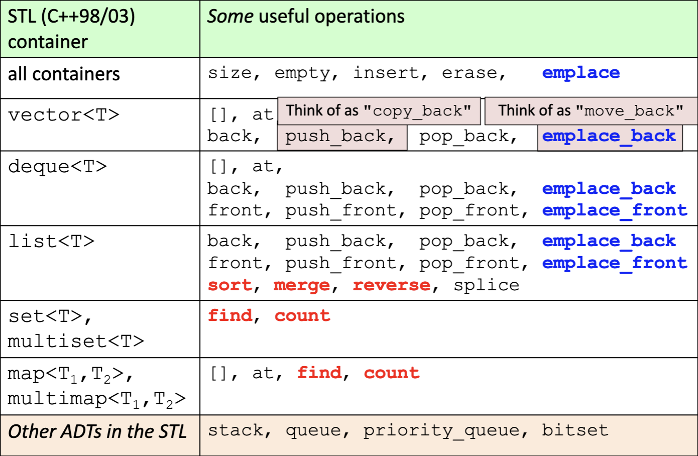

# Polymorphic Containers
...

# Inheriting from `vector<>`?!

Suppose we want to design a stack but all we have is a `vector`. You could tell your team to jus use the vector as a Stack.

Sometimes that's a reasonable decision although you incur _technical debt_. It is less comprehensible for people outside of your current team.

What about this?

```cpp
class Stack : public vector<string> {
public:
    Stack();
    ~Stack();
    void push(string s);
    string pop();
};
```

Pause. Great idea, but do realize by inheriting from vector, we give the user access to all of vector's public methods as well.

Sounds like we need a generic Stack class. More on generics later. For performance reasons no STL containers are `virtual`.

Thus operations like push will be different than push_back... we should think of Stack as something else entirely, not just a specialized vector. Thus we should not let Stack be a child of vector.

It makes a lot more sense, if we wish to implement using a vector, to set a vector as a private member variable. Or implement this using a linked list. When we decide to be lazy, we could produce lazy code. Inheritance is good, but not a solution for everything.

# Adding the Square

## Option 1
__Make `Square` a subclass of `Rectangle`.__

Easiest, least invasive to existing system design. What do we do with the inherited method `setSize(w,h)`? There are many possibilities.

1. Overload such that the second param is ignored.
2. Add `setSize` of one parameter. Redefine inherited version of two arguments to do nothing or make it private in `Square` or delete it from the API.

Although both break LPOS at the low level. Also it's a bad idea to inherit from a concrete class.

## Option 2
__Add square as an intermediate class (inheritance-wise) between Figure and Rectangle.__

Add `setSize(w)` and override with `setSize(w, h)` in Rectangle. But this violates LPOS since the parent should be more general.

## Option 3
__Make Square and Rectangle inheritance siblings.__

However, no consolidation of common code is possible. Squares cannot be treated polymorphically as Rectangles, just as Figures.

## No Solution?

Great. All three options have been discussed. This problem seems trivial, but this is in reality a fundamental problem in OO design called [the circle-ellipse problem](http://en.wikipedia.org/wiki/Circle-ellipse_problem).

We sometimes tend to call inheritance __generalization__. We mean that the parent class defines a more general type, the child a more specific type.

The child is a kind of parent, not an instance of a parent. This distinction is very important.

## In Reality

The elegant design answer is to make them inheritance siblings. The usual practical answer is to make Square a child of Rectangle and just ignore the `setSize()` issue.

Especially if there is a lot of work in implementing these classes that can practically be reused. This approach obeys LPOS at the high level, if not at the method level.

Note that if Figures are immutable size-wise once set in the ctor, then there is no problem with option 1 since there is no `setSize()`.

The real answer is, depends on context.

## Design Persists

If you think real production code is perfect, just remember Java v1.0 inherited `Stack` from `vector`. The Java Collections Framework was introduced several years later with a better design, but this poor design remained for a very, very long time.

Be careful what you promise, because chances are, it's not going away for a while.

# Generics

This is a very easy concept to get in to, very difficult concept to master. C++ has a ton of underlying behaviors that we will not try to understand.

We're going to use templates so we understand how they are used and how to define generic classes and methods. We're not going to dive too deep, only to the point where we can use them for our purposes.

## Syntax

For the swap function, what if we wanted to be able to swap any two objects of the same type?

```cpp
void myswap(int &x, int &y) {
    const int temp = x;
    x = y;
    y = temp;
}
```

In other terms, make `myswap()` type-generic. We can do this in C++ using __templates__. Templates are a C++ language mechanism that can be used to implement generics. Here's what it looks like.

```cpp
template <typename T>
void mySwap(T& x, T& y) {
    // This type T must support assignment / copy ctor
    const T temp = x;
    x = y;
    y = temp;
}
template <typename T>
    void printPair(const T& x, const T& y) {
    // This type T must support "operator<<" via ostreams
    cout << "x = " << x << " y = " << y << endl;
}
```

Thus we see, the constraints on what type you can pass to T depend on how you use instances of T within the function.

# Generic Functions

Defining a generic function allows you to supply the type of the parameters only when you actually use the function. We have effectively defined a meta-parameter for the function.

Any uses of variables of type T inside the generic function have to be permissible by type T's supported methods. The actual check of whether what makes sense occurs during a special phase of compilation called _template instantiation_, which occurs after the C preprocessor but before the main compilation.

The exact details under the hood are very complicated. For now, let's accept the definition.

# Generic Classes

We can also define generic classes. We can use this idea to create generalized containers. For classes, `<T>` becomes a part of the type's name.

You can instantiate and call the methods using the actual type, like `flurble<int>`. Take a look at `generic_stack.hh`.

Note that `template <typename T>` needs to precede each method definition whether or not the method body actually mentions type T, because `T` is a part of the templated class.

We see that in `generic_stack.cc`.

Let us quickly remind ourselves that the stack uses the Adaptor design pattern. If you have special needs, _The STL way_ encourages users to define their own adapter classes based on STL container classes, and not based on inheritance.

The `Stack` designs exactly what the users need, no more, no less. It adapts a more generic container for its own purposes.

If the STL `stack` doesn't exist, then use a vector-based implementation over the homebrew linked list.  Implementers of library classes will usually try to hide their non-essential impl details from you; and you should be grateful for this information hiding.

# The C++ Standard Library

The Standard Library is the standard template library (STL) plus some other stuff. The official standard library has changed with different versions of language standards.

Not every compiler supports the latest C++ features. The most breaking change was the C++11  standard, and there were minor updates in 2014 and 2017.

[Boost](https://boost.org) is a place to look for new C++ libraries.

## History of STL Containers

C++98/03 defines three main data container categories.
1. Sequence Containers
    - vector, deque, list
2. Container Adapters
    - stack, queue, priority_queue
3. Ordered Associative Containers
    - (multi)set, (multi)map
    - For multimap, duplicate keys can be associated with different values.
    - Multiset allowes repeats. Unordered, but frequency of items are tracked.

C++11/14/17 adds:
1. Sequence Containersarray
    - forward_list
3. Unordered Associative Containers
    - unordered_(multi)set
    - unordered_(multi)map
    - Implemented using hash tables to allow multiple elements.

C++20/23/26 adds some suspicious stuff that we won't discuss.

## Conceptual View of Containers


## Details of Main STL Containers

1. `vector` is a dynamically resizable array.
    - Allows constant time random access to elements, using at() (with run-time bounds checking) or [] (without checking).
    - Adding an element onto the end (push_back) is guaranteed to be amortized constant time.
    - O(N) to insert/delete elements anywhere except the end.
    - It's implemented using C++ dynamic arrays.
2. `deque` is a double-ended queue, similar to vector
    - Allows O(1) random access to elements, plus O(1) growth at either end
    - Adds methods for accessing front like push_front() / pop_front().
    – O(N) to insert / delete in middle.
3. `list` is a doubly-linked list.
    - Support forward or backward iterators but no random access to elements.
    - O(1) to insert/delete in middle (once you've found the right spot)!
4. `set` is a set.
    - Oddly, by default elements must be sortable.
    - The C++11 container `unsorted_set` removes that restriction.
    - `set` is implemented by a red-black tree, offering O(log N) lookup/insert/delete.
    - `unsorted_set` is implemented as a hash table, offering O(1) lookup/insert/delete.
    - multisets allows an element to occur more than once.
5. `map` is like a clever array where the index type can be almost anything.
    - Also called _associative array_.
    - As with set, elements must be sortable.
    - The C++-11 container unsorted_map removes that restriction.
    - `multimaps` allow the same key to map to multiple values.

## Operations of Main STL Containers



_Red_ means there's a standalone algorithm of this name. `merge`, `sort`, and `reverse` are all real algorithms outside of the `list` class.

_Blue_ means methods new to C++11, supports `move()` semantics. Will not discuss for now.


