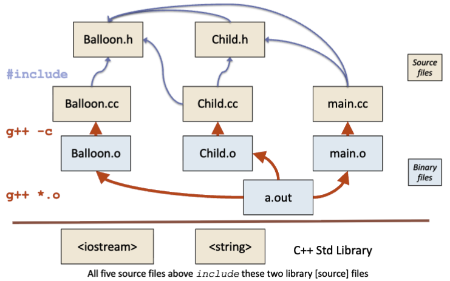

# Phases of Compilation in C++

Small programs (sub-1000 lines), the type we're writing, can easily fit into one file. We can directly compile using `g++`, run `./a.out`, end of story. However, for large programs that may have 100 or even 1000 classes, is it not more practical to separate your code into compilation units?

If you put everything into one file, you have to recompile everything from scratch each time changes are made. Inefficient, but also horrible if you are working with a team.

If you use multiple files, you have to recompile only the parts that changed (plus the other things that depend on them). Huge savings for big systems.

# Separate Compilation

A fairly standard approach in C++ is to use a __compilation guard__. If we have a class `F`, put the class declaration interface into a header file `F.h`, and surround it with `#ifndef F_H`.

Put the implementations of the methods into a separate file `F.cc`. In `main.h`, `#include "F.h"`, and execute the program there. Do not put `using namespace std;` into header files. The reason being, others using your implementation also needs to use that namespace.

There are two main phases to building a system.

1. __Compile__ each of the compilation units / source files (.cc files).
- `g++ -c F.cc` produces a new file `F.o`, an object file.
2. __Link__ the object files into single executable.
- `g++ -o fp *.o` generates machine code.

Let's take a look inside the `./balloon` folder.

```bash
$ cd balloon
$ g++ -c Balloon.cc
$ g++ -c Child.cc
$ g++ -c main.cc
$ g++ -o a.out *.o
$ ./a.out
Child named Trevor with a green balloon
Child named Ian with a red balloon
Child named Alex with a yellow balloon
```

## A Diagram of Dependencies



Note, the reason we include the Balloon class in `main.cc` is not because we need it, but for communication. Your code needs to be readable and comprehensible by other humans, not just the machine.

# 1. Inclusion and Compilation Dependence

1. First, __the C preprocessor runs__, performing `#include`, `#define` and checking `#ifdef` and `#ifndef`.
- This transforms the existing source code to new (expanded) source code
- Try `g++ -E F.cc` if (for fun!) you want to look at the results of this phase!

2. __Any classes defined using templates are created__; this is called template instantiation.
- Init lists initialize data members.
- `vector<string>` is created from generic library definition `vector<T>`
- This transforms the source code from the previous step to an internal representation.

3. __The results of the above are transformed into a (binary) object file__.
- The whole process is something like _source text -> token stream -> parse tree -> optimized parse tree -> object code_.
- You will learn a lot more about this in CS241, compilers!

# What `#include` Means

Each C++ file is (usually) compiled separately. It has to be able to see a declaration for any library and user-defined type / class that it uses so the compiler can verify that they are being used correctly. Thus each `.cc` file must include the appropriate `.h` files.

The eventual object file leaves an empty "slot" for the declared (but not yet defined) types / methods, until they are bound to an actual compiled implementation when all of the object files are linked together during the final stage of compilation.

Thus `#include` quite literally means to include that file in my file (a merging, of sorts) before being sent to the compiler. 

## What to Include

Each `.cc` file must include the corresponding header file.  Both C++ and header files should include the libraries they are using, as well as the header file of any user-defined class it references. `#include "Balloon.h"` in `Child.h` would be an example.

Let's revisit our diagram of dependencies.

## Compilation Guards

Note that the `#ifndef` compilation guard prevents the rest of the header file from being incorporated more than once for each `.cc` file being compiled. Thus it's more like a redefinition guard. 

In addition, `#ifdef` is critical in allowing code portability across different devices by including certain code sections only if a certain macro (eg. WINDOWS or MACOS) is defined.

To summarize, ifndef acts as a guard against multiple definitions, ifdef is primarily used to toggle features based on whether a symbol has been defined.

## Compilation Guards in Action

Now suppose `main.cc` and `Child.h` need to include `Balloon.h` and `main.cc` needs to include `Child.h`. Thus we have included the balloon header file twice when we compile main.

Without the ifndef guard, the compiler __will complain__ when it sees the class declaration for Balloon a second time, because a class cannot be declared twice. What actually happens is on the first time `Balloon.h` is included, the ifndef guard notices BALLOON_H is a variable that has never been seen before, and marks the macro as existing.

The second time, the BALLOON_H variable has been defined, so the entire declaration section is skipped.

# 2. Linking

Assuming each C++ file has been compiled into an object file. Because we included the header files, we have left space in each object file for named entities to be statically linked to their implementations. The object file includes something called a __symbol table__ that is a list of promises, including defined and undefined symbols.

Once all of the object files have been generated, we throw them into one final executable called `a.out` and hope all of the definitions can now be resolved. `Child.o` is looking for Balloon ctors, which it finds in `Balloon.o`. `main.o` is looking for Child ctor, dtor, and speak(), which it finds in `Child.o`.

Each object looks for what implementations are missing and hopefully finds them. Or else, the linker will ███ ████ ██████ █████ (LNK2019 error). The final executable should have a main program defined, which is what runs when you execute the file on the command line.

## Bad Inclusion Practices

__Do not__ get into the habit of including files you don't need "just in case I change my mind later." It can cause code bloat and confusion. For large systems, this can slow down system builds from including the things that never get used.

Do not fear the linker. The linker will tell you what to include and what to not. In addition, having too many inclusions is a sign your code is getting too long, and you should separate them.

## Compilation Dependencies Matter

Yay! Let's suppose you've compiled your program successfully and then you decide to make changes on some of the source files. No need to recompile everything. If file A.cc depends (transitively) on file B.h and file B.h changes, then A.cc needs to be recompiled.

If A.cc changes, you don't need to recompile B.h. Going back to the diagram of dependencies, it really depends on what needs to be recompiled. If Balloon.h changes, we need a full recompilation because basically everything depends on it.

This introduces the idea of having "breaking changes". Oftentimes, changes that touch these fundamental dependencies require extra revision, particularly in version control methodologies.

Changing a major design decision at the interface / API level typically means you need to change these header files, and if not done with caution, this can be very disruptive! On the other hand, fixing a bug or changing an implementation strategy does not involve these header files, which means less rebuilding.

# Finding Library Implementations

If you use quotes, the compiler looks in the current directory.

```cpp
#include "EntityCategories.h"
#include "gui/mainMenu.h"
```

Using angled brackets makes the compiler look in the standard library locations, but where are the interfaces stored? Often they're in a subdirectory of `/usr/include`, but there is truly no standard way to ask the compiler where the location is.

Good news is, there's the internet, and the compiler is smart enough to find it. So if you really want to dig the API, search it up!

## The Compiler Knows?

For separately compiled libraries (especially for C-language libs), the compiler magically knows where to find them and how to link them to your program. You might look in `/usr/lib` but different compilers do things differently.

For C++ template libraries, things are a bit different. Classes that are defined using C++ templates must be fully defined inside the interface file. There is no file-header split!

A template is not a class. It is a blueprint for a class. The compiler cannot generate machine code for `std::vector<T>` because it does not know what T is yet. It needs to know the size of T and how its operators work to create the specific binary.

If you put the definition of a template function in a `.cc` file, the compiler sees code but no instantiations. There will be no machine code generated, and later this will cause an undefined error.

If you include vector, string, iostream, etc., you are actually including quite a bit of source code. Although, vectors may hide its implementation through libraries like `<memory>` for allocation, and in the case of GCC, a private internal header called `bits/stl_vector.h`.

Each C++ file that includes vector has its own copy of the source code for vector, pulled in by the preprocessor during compilation. When we link all the object files at the end, the compiler is usually smart enough to consolidate duplicates. Plus, `vector` is a very well-tested and well-designed library, being one of the most fundamental yet most popular containers.
