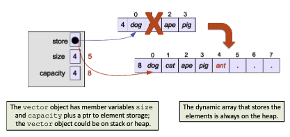
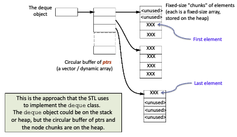

# Diving Into Sequence Containers

Sequence containers order all constituents continuously. The order is not based on some intrinsic value of the element, rather on the order in which they were added. Containers adapters like `stack` and `queue` can be easily implemented using sequence containers.

Today we will visit familiar and new containers.

# `vector`

Starting with our variable-length array. Supports access to bounds using methods like `at()` and stores elements contiguously by the C++11 Standard. Append is ACT, since we may have to copy all elements to a larger block of memory.

| Access kind | Complexity | API support |
| :--- | :--- | :--- |
| random access | O(1) | `operator[]` or `at()` |
| append/delete last | O(1)* | `push_back`/`pop_back` |
| prepend/delete first | O(N) | *not supported as an API call* |
| random insert/delete | O(N) | `insert`/`erase` |

We should be very familiar with the vector model.



## Implementing a Vector

A vector has a pointer to the heap array, and two integers `size` and `capacity`. `operator=` and `at()` are very easily defined.

Calling `push_back()` when size is equal to capacity triggers a realloc. The realloc may invalidate any external references to previous elements, including iterators. Note this is an O(n) object copy, not a pointer copy (unless the objects are ptrs), hence it can be very memory-intensive.

Now, in terms of copy semantics, methods like push and pull always adds a __copy__ of the elements over using the element's copy ctor. In C++11, we also support methods that use the object's move ctor, called `emplace_front()` and `emplace_back()`.

There is also `emplace()`, which takes an element and an iterator as parameter to insert the element into that spot in the container. We now prefer these `emplace()` methods over the old push methods.

Depending on where we insert the element, time complexity may vary.

# `deque`

The deque is a double-ended queue. Similar to `vector` and all the containers we have discussed so far, but allows O(1) CRUD at the start and front of the container.

The random access is fast, but there is no gurantee they are stored contiguously. Pointer arithmentic won't work. However, the operators `[]` and `at()` are defined carefully to work.

| Access kind | Complexity | API support |
| :--- | :--- | :--- |
| random access | O(1) | `operator[]` or `at()` |
| append/delete last | O(1)* | `push_back`/`pop_back` |
| prepend/delete first | O(1)* | `push_front`/`pop_front` |
| random insert/delete | O(N) | `insert`/`erase` |


## Circular Buffer Model

The conceptual model of the deque is similar to the vector. When we need more storage, realloc, get a bigger dynamic array from the heap, copy the elements over to the new space, and delete the old dynamic array.

However, the unique twist is to treat the storage like a circular buffer so we can add to either end in constant time. A very nice idea, but the actual model is far more complicated.

We need to provide specialized definitions of `operator[]` and `at()` using offsets and modular arithmetic when you start to add elements at the front because the ptrs are circular.

Insertion at either end is also amortized constant time in terms of # of object copies performed. It's O(1) unless you need to reallocate, in which case it is O(N). Note, that's not how deque is actually implemented.



The deque uses a similar structure as the chunky stack. We implemented this in assignment 4, but the deque uses a circular buffer of pointers to point to these chunks. Let's assume N deque elements in total, and a chunk size of K.

We need to allocate new chunks periodically, assuming no excessive object copying aside from an insertion at the front or the back. According to the C++ standard, the occasional _N/K_ ptr copies don't count against the complexity as only one element (the pointer) is copied into a chunk.

# `vector` or `deque`?

For deques, `operator[]`, `at()`, and iterator implementations need to be a bit clever.  However, it's just modular arithmetic and pointer dereferences. In reality, vectors may be a bit faster for random access.

The advantage of deques is having very quick CRUD for the front and back. Occasional allocations cost _N/K_ copies rather than _N_ copies. If _K_ is large, we may have a much faster copy! However, we may end up with wasted space (poor space complexity).

If we need to insert at the front, use `deque`. If we need to insert in the middle, use `list`. If we need a general-purpose container, use `vector`. While random access to elements is constant time for both deque and vector, a vector may be faster in reality.

The C++11 standard advises _when in doubt, use a vector_ because it has everything a container need for our purposes.

__Reallocations__
- Take longer with a `vector` (N for vector, N/K for deque)
- `vector` invalidates external refs to elts, but not so with a deque
- `vector` copies elements (which may be objects), deque copies only ptrs

Yes, in case you are wondering, `deque` converves external pointer integrity.

## Integrity of References

```cpp
int* p = &d.back();
cout << *p << " " << d.at(3) << " " << p << " " << &d.at(3) << endl;
d.resize(32767); // Probably causes realloc
cout << *p << " " << d.at(3) << " " << p << " " << &d.at(3) << endl;
```

Both of these outputs should be the exact same, even after a realloc. Here's the output, in comparison for a vector and a deque.

```bash
$ ./a.out
15 15 0x7ff87bc039cc 0x7ff87bc039cc
15 15 0x7ff87bc039cc 0x7ff87bc039ec
15 15 0x7ff87c00220c 0x7ff87c00220c
15 15 0x7ff87c00220c 0x7ff87c00220c
```

### Integrity in a Vector

Triggering a realloc in `vector` causes the pointers to move somewhere else. In our example run, the runtime system did not rewrite anything, but we see the address has changed.

We could have easily reached a seg fault instead, because that old address is not really useful anymore. That address may be rewritten later, causing an error. Such errors are very hard to trace.

A nice example of how an observed error and its underlying root cause may be unrelated.

### Integrity in a Queue

With a deque, any external pointer directly to an element will be valid as long as you don't remove that element.

Triggering a realloc causes the buffer of pointers to be reallocated; the chunks of element storage stay where they are; only the new element is copied into its place.

Note, if more elements are added, the index of that element may no longer be 3, but something else depending on the size of the queue.

# `list`

A doubly linked list. In fact, all linked structures in STL are doubly-linked, allowing iterator traversal up or down the strucutre.

The `list` provides O(1) push and delete to the front and back, but unlike `deque`, there is no random access. You can only use iterators or pointers to sequentially traverse through the container, although once you arrive at an element, the access is O(1).

| Feature | Behavior | Notable Detail |
| :--- | :--- | :--- |
| **Random Access** | **$O(N)$** | No `[]` operator. You must manually iterate through nodes. |
| **End Operations** | **$O(1)$** | Efficiently adds/removes at both head and tail. |
| **Middle Operations**| **$O(1)$*** | The insertion/deletion itself is constant time, *provided* you already have an iterator pointing there. |
| **Memory Layout** | **Noncontiguous** | Unlike vectors/deques, elements are scattered nodes connected by pointers. |

# `array`

Functionally, it's a compile-time fixed time vector. Offers essentially the same functionalities as a C-style array with none of the drawbacks.

Array defines
- at()
- size()

Array does not support
- push_back(), emplace_back(), pop_back(), insert, erase, resize, etc.

There is no reason to use a C-style array over `std::array`. We only use these arrays if its size is known and constant. Furthermore, the array is on the runtime stack, not the heap!

Sometimes, `array` will be a little bit faster and more space efficient. Offers instant access, does not even cost a pointer dereference like `vector`. There is no good reason to use a C-style array in C++.

# `forward_list`

If you want a linked list, you can use `forward_list`. Does not even support `push_back()` and `back()`. You use the ability to iterate backwards.

You gain a little bit of space efficiency (one ptr per node) and there is no `size()` method. This only finds use cases in very niche situations.

# Associative Data Containers

We already covered these, being `map` and `unordered_map`. We can access an element using a key value. While `map` is ordered (implemented using a self-balancing binary search tree), `unordered_map` is a hash table.

Thus the ordering is based on some key value, not the order of insertion. There may or may not be a natural ordering among the key values of the contained elements, but one must be defined!

There are also _multi_ variations of the associative data containers that allow multiple occurances of a single object. Normally, `map` and `set` enforce uniqueness of constituents.

## Differences to Sequential Containers

Associative data containers do not store their elements in contiguous memory. Elements are found by value (not by index), and iterator logic is very complex. In general, associative containers associate their order to some sort of key.

Thus, use associative containers when you need fast retrieval of elements based on a specific key, sequential containers when order matters and we need more efficient access by index. Remember, if we have a problem with multiple requirements, try breaking the problem down (functional decomposition) and figure out a way we can use our containers to solve the problem in combination.
