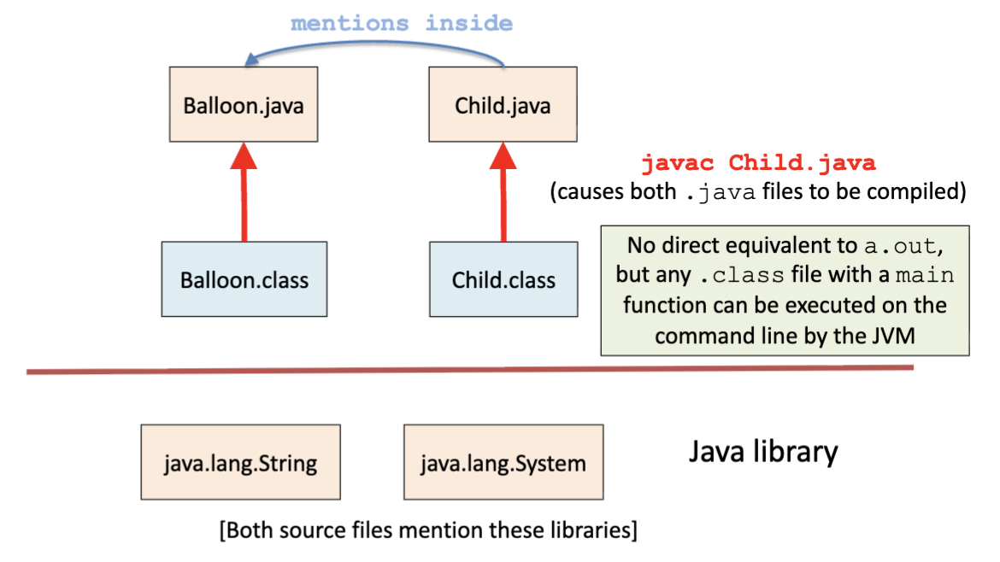
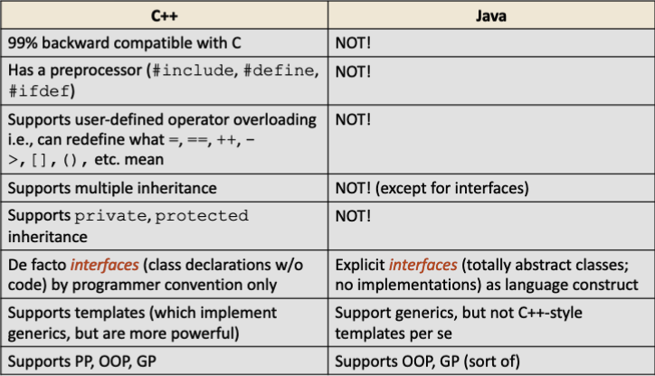
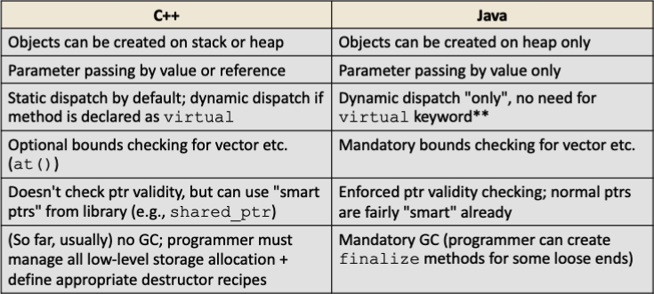
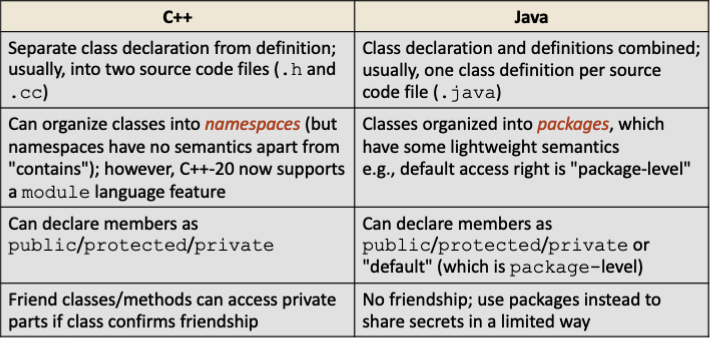

# Automation Using `make`

There is an old but powerful UNIX command line tool called `make`. It can automate build recipes. It's decently smart about what needs to be rebuilt after changes occur by tracing dependencies.

However, you need to provide a recipe, called a MakeFile. There are many other far more sophisticated tools like ant, maven, SCons, etc. However, if you use popular IDEs like IntelliJ and VSCode automatically tracks what needs to be recompiled.

Make may be much smarter at recompiling only bits that really need it. Not file leve, function level.

```bash
$ ls
Coords.cc  Coords.h  main.cc  main.d  main.o  Makefile
$ make
g++  -std=c++14 -Wall -MMD    -c -o Coords.o Coords.cc
g++  main.o Coords.o  -o coords-main 
$ ls
Coords.cc  Coords.d  Coords.h  coords-main  Coords.o  main.cc  main.d  main.o  Makefile
$ ./coords-main
2 3
c1: (3, 5)
c2: (2, 3)
(3, 5) + (2, 3) = (5, 8)
(3, 5) * 5 = (15, 25)
5 * (2, 3) = (10, 15)
$ make
make: 'coords-main' is up to date.
$ make clean
rm -f main.o Coords.o  coords-main  main.d Coords.d 
$ ls
Coords.cc  Coords.h  main.cc  Makefile
$ touch Coords.h
$ make
g++  -std=c++14 -Wall -MMD    -c -o main.o main.cc
g++  -std=c++14 -Wall -MMD    -c -o Coords.o Coords.cc
g++  main.o Coords.o  -o coords-main 
$ make -n clean
rm -f main.o Coords.o  coords-main  main.d Coords.d 
$ ls
Coords.cc  Coords.d  Coords.h  coords-main  Coords.o  main.cc  main.d  main.o  Makefile
```

# Building `java` Programs

In Java, we don't separate interface from implementation. Everything goes into a big `.java` file. Java has __no__ preprocessor. No `#include`, no compiler guards.

Usually, for a given program, there is one class that has the real main program, but any class can have its own main program too.

This allows each individual class to contain unit tests for that class, though we can define separate testing in parallel.

For any given execution of the JVM, only one `main` will run! For more complicated builds, there are Java-specific compilation tools like ant and maven.

## Dependency Diagram



A Java source file, called `J.java`, can be compiled separately.

```bash
$ javac J.java
```

`javac` is the Java compiler. This will trigger the compilation of all other classes `J` uses or depends on.

Separate compilation produces a file called `J.class`. If `J` has a main function, you can run it at the command line.

```bash
$ java J
```

`java` is the Java run-time environment. You can also package a set of classes into a single executable Jar (wonderland.jar) for convenient distribution.

Let's say Balloon and Child both have main functions. Both can be run at the command line. In this case it's common to create test suites for the source code class, this is called unit testing.

For simple classes, this means creating a simple main program in each class. For large programs, you can create a class just for testing for each source class in the codebase.

`BalloonTest.java` and `ChildTest.java`, for example. `JUnit` is one of the most popular Java unit test frameworks, similar to `GTest`, which came later!

# A Comparison of C++ and Java

C++ was the first C-like object oriented language, developed in the 1980s. Objective-C came later, and C# came much later. Assumes you are a good programmer, which is never a good assumption to make.

Java is allegedly a simpler, cleaner, and more portable version of C++. Java features improved safety like ptr validity and array bounding at the cost of performance. Java relies on a run-time system called the JVM for performance. 

C# is an even safer version of Java. Looks similar to Java. The runtime system, the CLR, does a lot of the heavy lifting.

## Commonalities and Differences

Java has C-like syntax and supports for basic types like int, floats, bool. Both share a similar memory model, but in Java objects are created only on the heap. Java is an inherently object-oriented language with strong support for generics.

Java also has garbage collection and better exception handling. Java also has strong library support, including generic data containers from the STL and the JCF (Java Collections Framework).

The source model of C++ and and Java also differ.

__C++__
- "Compile Everywhere"
- Directly compiles to native, platform-dependent code.
- If `LobbyAssigner.cc` is compiled to `LobbyAssigner.out` on Linux, the executable will only work on Linux, not on Windows, not on Mac or any other UNIX variant.

__Java__
- "Compile Once, Run Everywhere"
- Compiles to _Java byte code_ which is universal, machine-level binary.
- Needs a JVM to exist on each deployment platform.
- Thus if `Balloon.java` is compiled to `Balloon.class` on Linux, the same binary will run on MacOS JVM, WindowsOS JVM, or even Android JVM.

# A Chart of Differences



Note, `final` methods are statically dispatched (hard coded at compile time), but that's semantically indistinguishable from dynamic dispatch (searches for definition at run-time).

